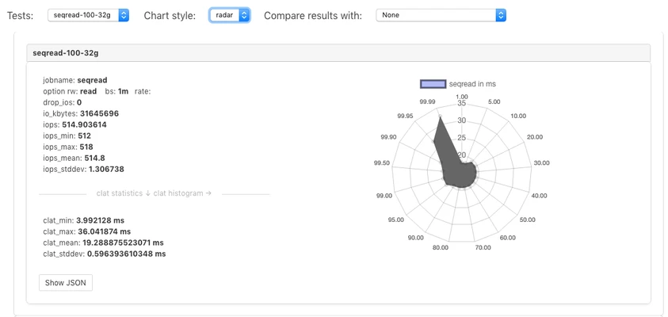

# Testing disk subsystem with fio and perfscripts

`fio` is a very flexible tool for performance testing of disk I/O subsystems that allows to create scenarios for repeatable testing of disks when doing the capacity planning for Cassandra and DSE.  [Jonathan Shook](https://github.com/jshook) created a project called [perfscripts](https://github.com/jshook/perfscripts) that provides dozens of ready-to-use scenarios that emulate Cassandra-style workloads, so we can use them to perform testing of selected disks, and compare results against a number of baseline results that are also provided as part of this project.

Scripts that are included into `perfscripts` project not only collecting the performance data, but also generate a HTML page with embedded JavaScript for visualization of collected data (this is especially useful when comparing results with baseline):

The overall testing procedure looks as following:

* make sure that you have fio 3.x installed - many repositories still have version 2.x, and although the tests will work, the UI won't handle the results correctly
* clone the [repository](https://github.com/jshook/perfscripts)
* execute tests with command: `bin/run-fio-tests -r <results_directory> -d <directory_on_disk_to_test>` (`README.md` file lists some additional options that could be useful, but not very often used). You can also specify a number of tests to run if you don't want to wait for all 53 tests
* open `<results_directory>/index.html` file in the browser, or run `python -m SimpleHTTPServer` in the results directory, and access data via Python web server

Besides generation of the bar charts, you can display data as radar, so it could be easier to compare in some cases:

